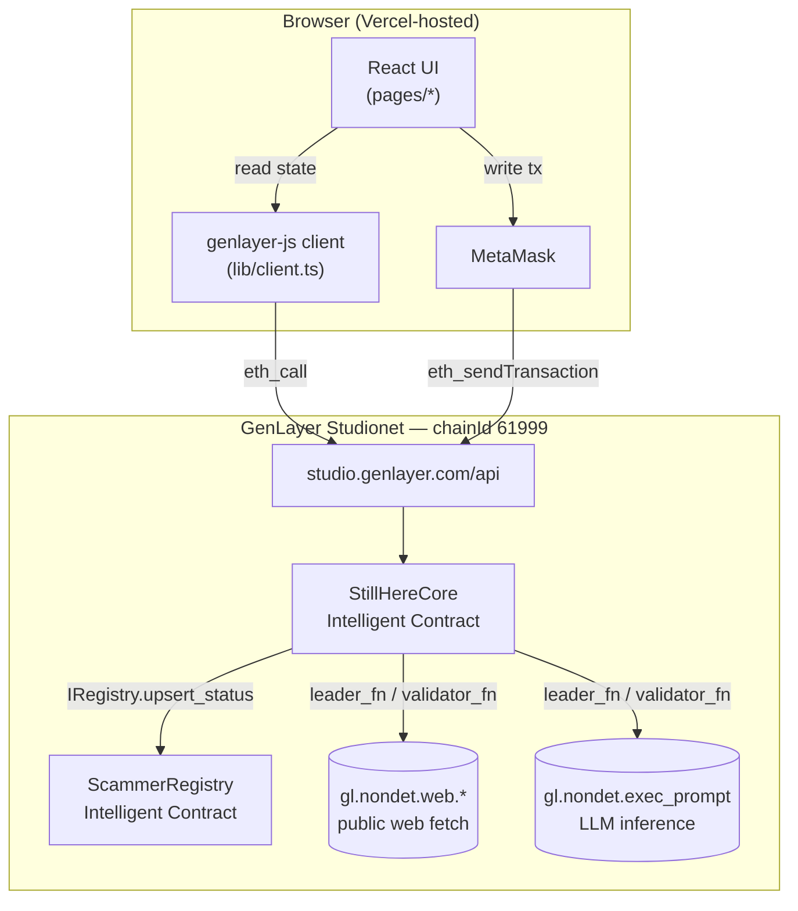
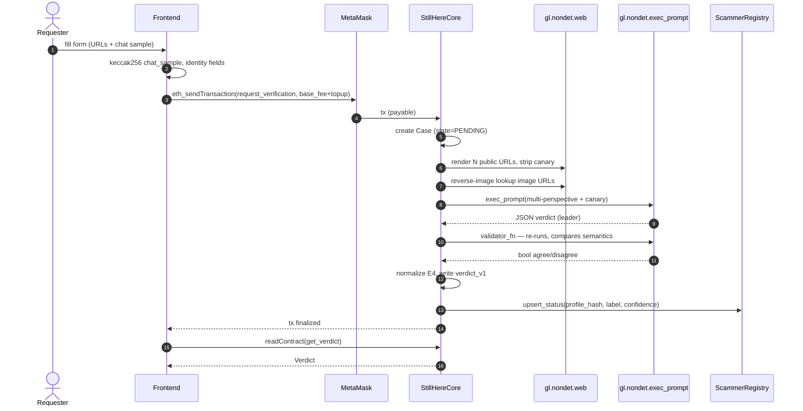
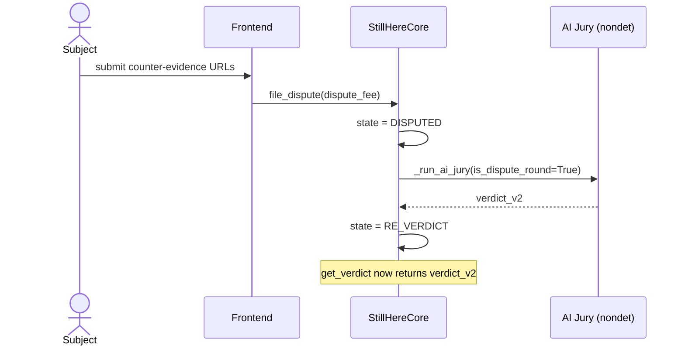
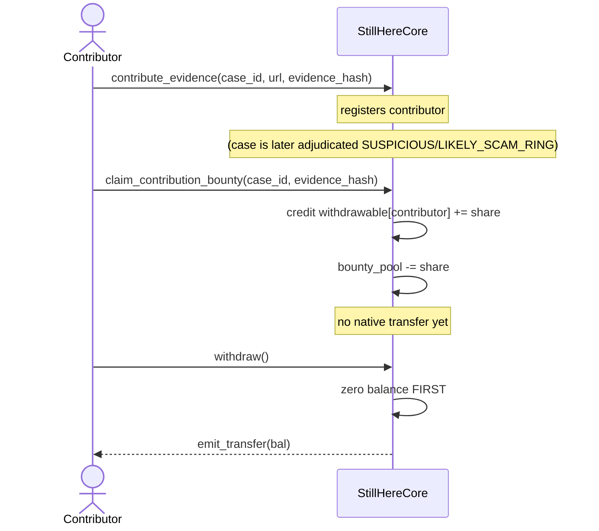
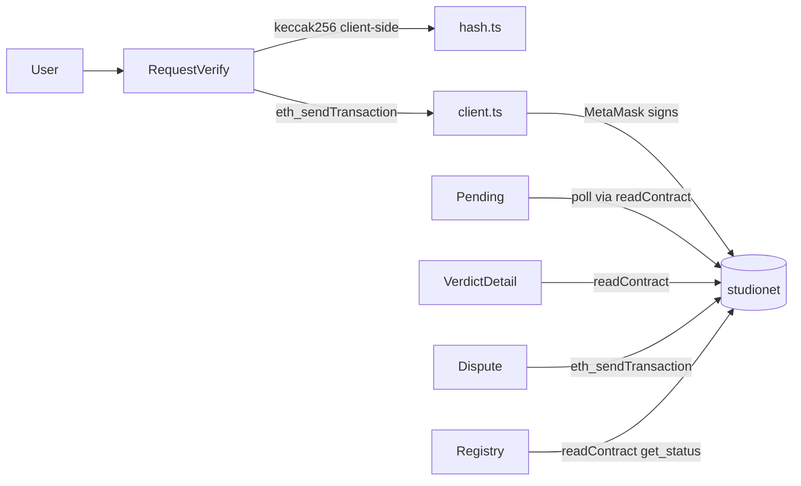

# StillHere — Architecture

## 1. System Overview

StillHere is a two-contract Intelligent Contract system deployed on **GenLayer studionet** with a Vite+React frontend that signs transactions via MetaMask and reads state via `genlayer-js`.

## 2. Contract Boundaries

### StillHereCore ([`contracts/stillhere_core.py`](contracts/stillhere_core.py))
- Owns: cases, evidence contributions, contributor→address map, bounty accounting.
- Runs the AI Jury (`_run_ai_jury`) via `gl.vm.run_nondet(leader_fn, validator_fn)`.
- Cross-calls `ScammerRegistry.upsert_status` after every verdict, `subscribe_watcher` on user request.

### ScammerRegistry ([`contracts/scammer_registry.py`](contracts/scammer_registry.py))
- Owns: profile_hash → aggregate status, watchers per profile.
- Only accepts writes from the core contract (address-checked in `upsert_status`/`subscribe_watcher`).
- Registered after deploy via `set_core(core_addr)` — admin-only, one-time.

## 3. Verification Sequence

## 4. Dispute (Round 2) Flow

## 5. Pull-Payment Bounty Flow

Two-step withdraw defeats reentrancy: the withdrawable balance is zeroed before the native transfer executes.

## 6. Storage Layout

### StillHereCore
| Field | Type | Purpose |
|---|---|---|
| `cases` | `TreeMap[str, Case]` | Case id (stringified) → full case record |
| `profile_to_cases` | `TreeMap[str, DynArray[str]]` | Canonical profile_hash → case ids |
| `contributions` | `TreeMap[str, DynArray[str]]` | Case id → evidence URLs |
| `contributors` | `TreeMap[str, TreeMap[str, Address]]` | Case id → (evidence_hash → contributor) |
| `contribution_claimed` | `TreeMap[str, TreeMap[str, bool]]` | Case id → (evidence_hash → claimed) |
| `withdrawable` | `TreeMap[str, bigint]` | Contributor address (lowercase) → GEN owed |
| `registry` | `Address` | ScammerRegistry contract |
| `admin` | `Address` | Deployer, treasury withdrawer only |
| `treasury` | `bigint` | Accumulated fees (base + dispute) |
| `next_case_id` | `bigint` | Monotonic case counter |
| `base_fee`, `dispute_fee` | `bigint` | Native GEN fees per action |
| `contributor_share_bps` | `u16` | Basis points of bounty_pool paid per confirmed contribution |
| `scam_confidence_threshold` | `u8` | E4 downgrade threshold (default 85) |
| `scam_critical_flags_required` | `u8` | E4 downgrade threshold (default 2) |

### ScammerRegistry
| Field | Type | Purpose |
|---|---|---|
| `statuses` | `TreeMap[str, ProfileStatus]` | profile_hash → aggregate |
| `watchers` | `TreeMap[str, DynArray[Address]]` | profile_hash → watcher list |
| `core` | `Address` | Only address allowed to write |
| `admin` | `Address` | Sets `core`, one-time |

## 7. Frontend Data Flow

- **Single source of truth for chain config**: `frontend/src/lib/client.ts` defines `studionet` via `viem.defineChain(...)` pointing at `https://studio.genlayer.com/api` (chain id `61999`). `frontend/src/lib/wallet.ts` imports the same constants for `wallet_addEthereumChain`, so there is no drift between MetaMask's network and the read client.
- **Writes**: always go through `sendGenLayerTransaction` → `window.ethereum.request('eth_sendTransaction')` so MetaMask signs; no private keys touch the bundle.
- **Reads**: go through `client.readContract` which resolves to `eth_call` against studionet RPC.

## 8. Deployment

See [`scripts/deploy.md`](scripts/deploy.md) for the current deployed addresses and constructor arguments.
