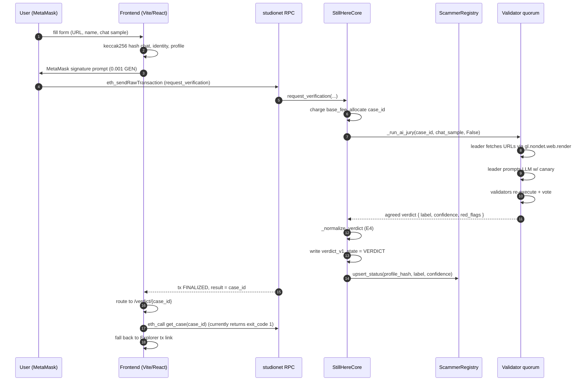
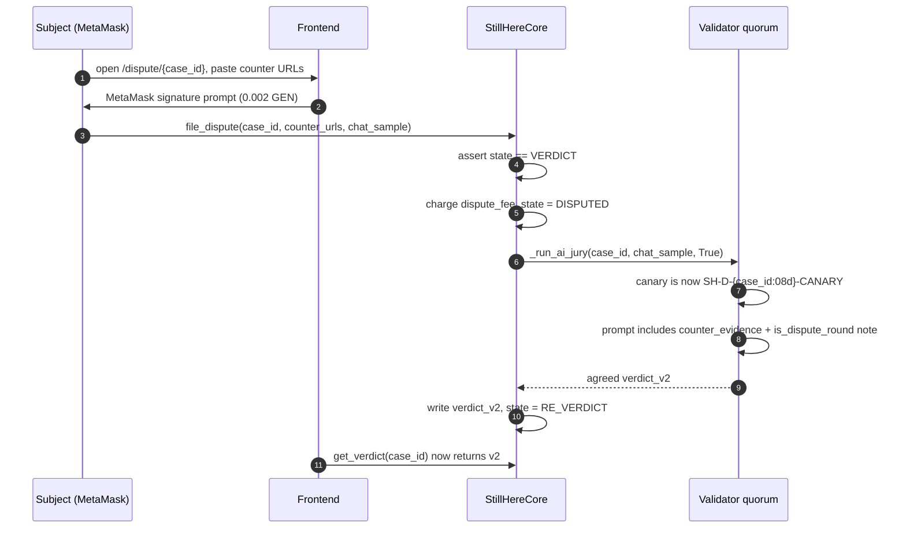
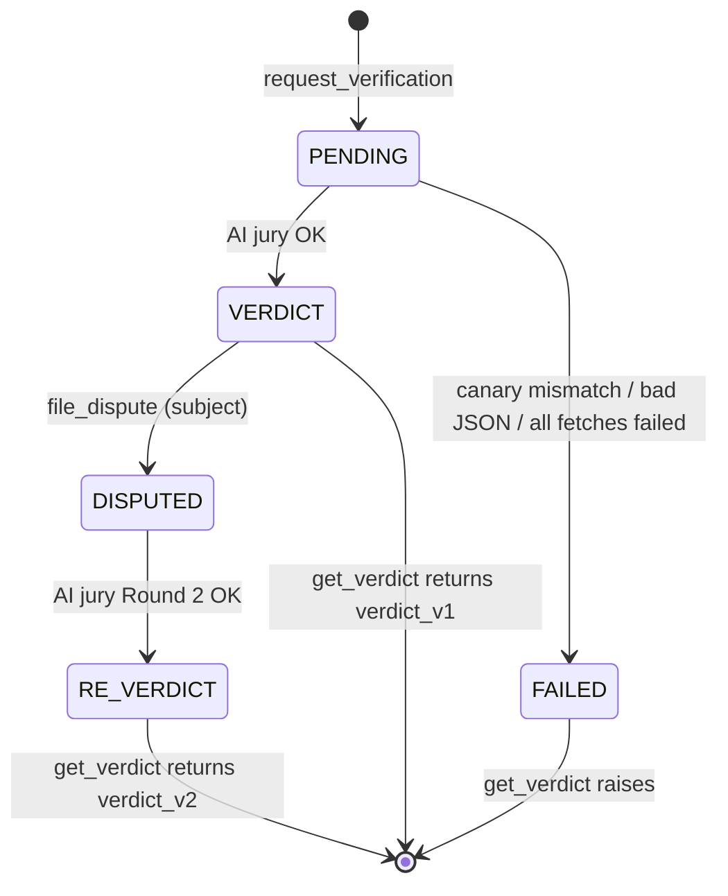

# StillHere — Sequence Diagrams

Companion to [`ARCHITECTURE.md`](../ARCHITECTURE.md). Read that first
for the static picture; this doc has the runtime flows.

---

## 1. Request → Verdict (happy path)



---

## 2. Dispute → Round 2 re-adjudication



---

## 3. Contribution → Bounty pull-payment

```mermaid
sequenceDiagram
  autonumber
  participant C as Contributor
  participant Core as StillHereCore

  C->>Core: contribute_evidence(case_id, url, hash)
  Core->>Core: dedup evidence_hash per case
  Core->>Core: append URL, record contributor address

  Note over Core: (Later) a dispute round re-runs the jury<br/>weighing the contributed URLs.
  Note over Core: If final verdict is SUSPICIOUS or LIKELY_SCAM_RING:

  C->>Core: claim_contribution_bounty(case_id, hash)
  Core->>Core: assert caller == recorded contributor
  Core->>Core: share = bounty_pool * contributor_share_bps / 10000
  Core->>Core: withdrawable[C] += share, bounty_pool -= share
  C->>Core: withdraw()
  Core->>Core: bal = withdrawable[C]; withdrawable[C] = 0
  Core->>C: emit_transfer(value=bal)
```

The zero-then-transfer order in `withdraw()` is the reentrancy
defence — any callback into `withdraw()` sees a zero balance and
reverts on the `nothing to withdraw` guard.

---

## 4. Case state machine



Only one dispute round is allowed (see ADR 0004).
